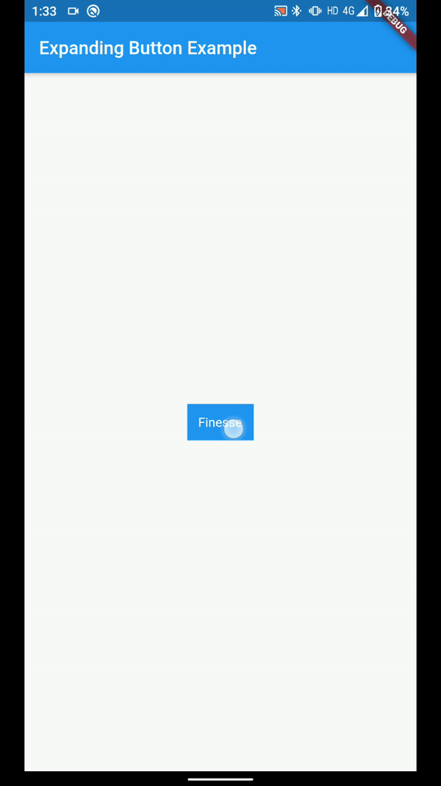

# Expanding Button

A Flutter package containing an animated button that expands without causing overflow and changes colour on tapping.

## Screenshot



### Do :star: the repo if you like it!

## Usage

To use this package add the following dependency to your pubspec.yaml file:

```yaml
  dependencies:
    flutter:
      sdk: flutter
    expanding_button:
```

## Usage Example

An example file can be found [here](example/example.dart)

Expanding button takes in the following parameters:

####    1. child (Type Widget) (@required)
```dart
    ExpandingButton(child: Text('This can be any widget'));
```

####    2. onTap (Type VoidCallBack)
```dart
    ExpandingButton(
        child: Text('This can be any widget'),
        onTap: () {
            print('This can be any voidcallback which is called on tapping');
        }
    );
```

####    3. onTapWhenExpanded (Type VoidCallBack)
```dart
    ExpandingButton(
        child: Text('This can be any widget'),
        onTap: () {
            print('This can be any voidcallback which is called on tapping when button is expanded');
        }
    );
```

####    4. background (Type Color)
```dart
    ExpandingButton(
        child: Text('This can be any widget'),
        // This is the background color of button in non-expanded state        
        background: Colors.blue
    );
```

####    5. backgroundAfterAnimation (Type Color)
```dart
    ExpandingButton(
        child: Text('This can be any widget'),
        // This is the background color of button in expanded state        
        backgroundAfterAnimation: Colors.greenAccent
    );
```

## License

    Copyright 2020 Abhishek Upmanyu

    Licensed under the Apache License, Version 2.0 (the "License");
    you may not use this file except in compliance with the License.
    You may obtain a copy of the License at
    
        http://www.apache.org/licenses/LICENSE-2.0
    
    Unless required by applicable law or agreed to in writing, software
    distributed under the License is distributed on an "AS IS" BASIS,
    WITHOUT WARRANTIES OR CONDITIONS OF ANY KIND, either express or implied.
    See the License for the specific language governing permissions and
    limitations under the License.
